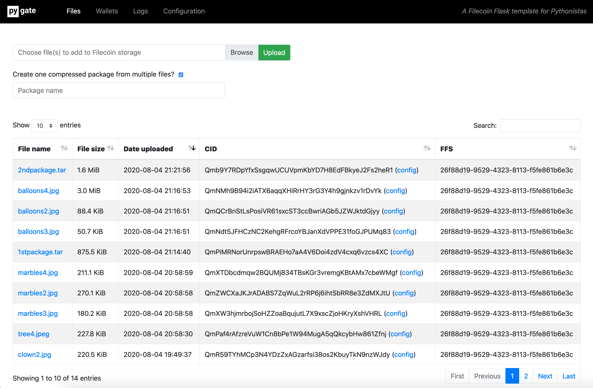

# pygate-webapp
A Filecoin Flask template application for Python developers using Textile.io's [Powergate](https://docs.textile.io/powergate/) and the [Pygate gRPC](https://github.com/pygate/pygate-gRPC) client.

# Installation
* Clone files and cd to directory:  
  `git clone https://github.com/pygate/pygate-webapp && cd pygate-webapp`  
* Set up virtualenv:  
  `virtualenv venv`  
* Activate virtualenv:  
  `source venv/bin/activate`  
* Install requirements:  
  `pip install -r requirements.txt`
* Create the application database:  
  `python create_db.py`
 * pygate-webapp is built using the [Python Flask](https://www.fullstackpython.com/flask.html) framework. To start the built-in development server:  
 `python run.py`
* Go to `localhost:5000` in your browser to use the app.
* This is a development release of the pygate-webapp. It is designed to work with a Dockerized [Localnet Powergate](https://docs.textile.io/powergate/localnet/). It assumed this is running at the `127.0.0.1:5002` address. You can change the POWERGATE_ADDRESS in the `config.py` file.

# Features
* Upload a file or multiple files from your local machine to the Filecoin network.
* Download them from Filecoin back to your local machine.
* Check Wallet balances.
* Change Filecoin Filesystem (FFS) configuration settings and push them to files in storage.
* Review logs of your activities in the Pygate webapp.
